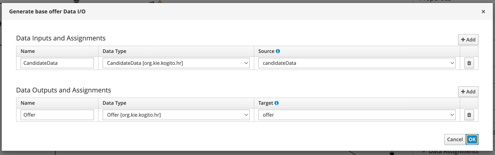
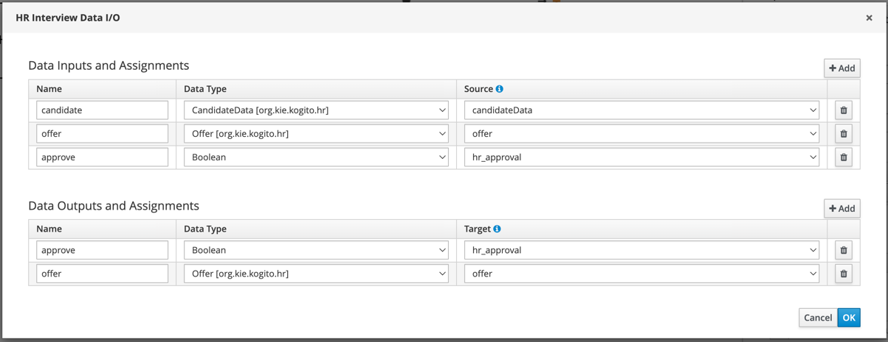
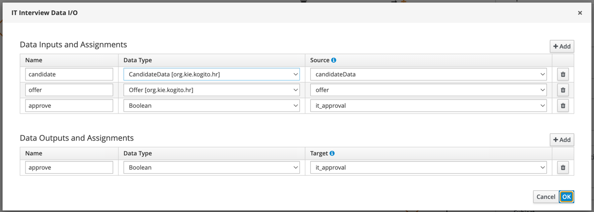
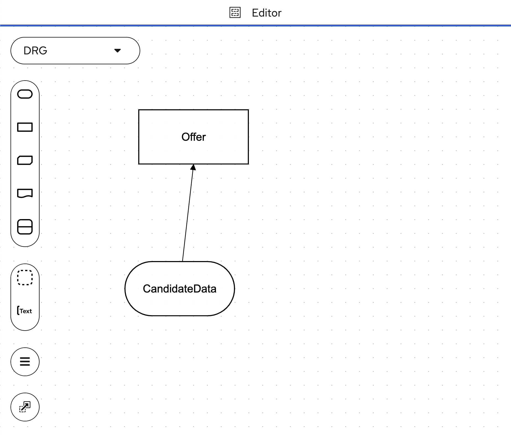
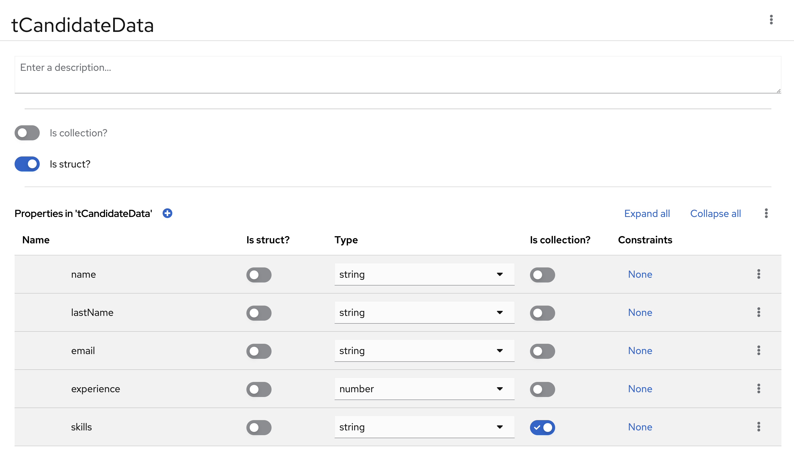
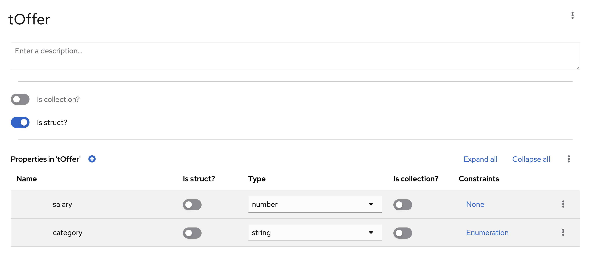
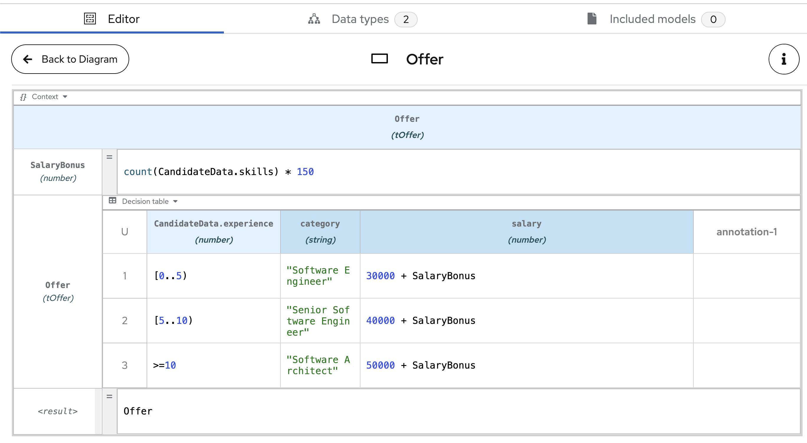

<!--
   Licensed to the Apache Software Foundation (ASF) under one
   or more contributor license agreements.  See the NOTICE file
   distributed with this work for additional information
   regarding copyright ownership.  The ASF licenses this file
   to you under the Apache License, Version 2.0 (the
   "License"); you may not use this file except in compliance
   with the License.  You may obtain a copy of the License at
     http://www.apache.org/licenses/LICENSE-2.0
   Unless required by applicable law or agreed to in writing,
   software distributed under the License is distributed on an
   "AS IS" BASIS, WITHOUT WARRANTIES OR CONDITIONS OF ANY
   KIND, either express or implied.  See the License for the
   specific language governing permissions and limitations
   under the License.
-->

# Example :: Process Persistence

This example depicts the usage of persistence configuration for various databases like H2, Postgresql and MS SQL. 
This application can be run in dev and container modes.

This example also showcases a basic implementation of a **Hiring** Process that drives a _Candidate_ through different
interviews until they get hired. It features simple User Task orchestration including the use of DMN decisions to
generate the candidate's offer and timers to skip interviews.

---

### The _"Hiring"_ Process (BPMN)

The process handles the following _Variables_:

| Variable          | Type                              | Tags         | Description                                       |
| ----------------- | --------------------------------- | ------------ | ------------------------------------------------- |
| **candidateData** | `org.kie.kogito.hr.CandidateData` | **input**    | The candidate data                                |
| **offer**         | `org.kie.kogito.hr.Offer`         | **output**   | The generated candidate offer                     |
| **hr_approval**   | `Boolean`                         | **internal** | Determines that HR department approves the hiring |
| **it_approval**   | `Boolean`                         | **internal** | Determines that IT department approves the hiring |

---

<div style="text-align:center">
   <figure>
      
      <br/>
      <figcaption>Hiring Process Diagram</figcaption>
   </figure>
</div>

The process starts receiving the `CandidateData` as an input and storing it into the `candidateData` variable, and if
the candidate meets two minimal requirements, the process will continue and reach the **Generate base offer**, otherwise
the candidate application will be denied and the process will complete without sending the `offer` to the candidate.

The **Generate base offer** is a _Business Rule Task_ that will use the _New Hiring Offer_ decision defined in the
`NewHiringOffer.dmn` to generate the an `Offer` based on the candidate experience and skills. The task takes the
`candidateData` as an input and will produce an instance of `org.kie.kogito.hr.Offer` that will be stored in the `offer`
variable.

<div style="text-align:center">
   <figure>
      
      <br/>
      <figcaption><b>Generate base Offer</b> data assignments</figcaption>
   </figure>
</div>

After the `offer` has been generated, the process will jump into the **HR Interview** _User Task_, where the candidate
we'll be interviewed by the _HR_ department. The task takes the `candidateData` and `offer` as inputs and as an output
will produce the `hr_approve` boolean and an updated `offer`.

<div style="text-align:center">
   <figure>
      
      <br/>
      <figcaption><b>HR Interview</b> task data assignments</figcaption>
   </figure>
</div>

The **HR Interview** _User Task_ also has a _Boundary Timer Event_ that will prevent the task to delay and will cancel
the
task after certain time (for example purpose just 3 minutes). This _Boundary Timer Event_ will schedule a Job in the
Jobs Service
that when trigger will notify the _Kogito Runtime_ to cancel the task and deny the application.

If **HR Interview** successfully completed, the process will jump into the **IT Interview** _User Task_. Again the
candidate
we'll have a second interview with the _IT_ department. Again, this task will take the `candidateData` and `offer` as
inputs
but as an output will produce the `it_approve` boolean.

<div style="text-align:center">
   <figure>
      
      <br/>
      <figcaption><b>IT Interview</b> task data assignments</figcaption>
   </figure>
</div>

Once both tasks are completed, if the candidate got the approvals from _HR_ & _IT_ (both `hr_interview` & `hr_interview`
being true)
the process will jump into the **Send Offer to Candidate** _Script Task_ that will notify the candidate about the offer
and the process will end.

> **NOTE:** for simplicity, all the _User Tasks_ in this example are assigned to the _jdoe_ user present in the Keycloak
> configuration

### The _"New Hiring Offer"_ Decision (DMN)

This example makes use of the _New Hiring Offer_ DMN to generate a base offer for the `Candidate`. The DMN looks like
this:

In this simple DMN we have an `Offer` _Decision_, that will generate the candidate offer, which
has a requirement of a `CandidateData` _Input Data_.

<div style="text-align:center">
   <figure>
      
      <br/>
      <figcaption>New Hiring Offer DMN diagram</figcaption>
   </figure>
</div>

The DMN defines the following data types (`tCandidateData` & `tOffer` ) matching the Java POJOs defined in the project
(`CandidateData.java` & `Offer.java`):

<div style="text-align:center">
   <figure>
      
      
      <br/>
      <figcaption>New Hiring Offer DMN types</figcaption>
   </figure>
</div>

As expected, `CandidateData` Input and `Offer` Decision have a `tCandidateData` type

The `Offer` Decision uses the following _Boxed Expression_ to generate the `tOffer`:

<div style="text-align:center">
   <figure>
      
      <br/>
      <figcaption><i>"New Hiring Offer"</i> DMN Decision</figcaption>
   </figure>
</div>

### The Java models

The **Hiring** process uses two POJOs to handle the process data, both of them can be found in the _org.kie.kogito.hr_
package.

The `CandidateData` POJO is the input of the process. It represents the person that wants to get the job.

```java
public class CandidateData {

    private String name; // Name of the candidate
    private String lastName; // Last name of the candidate
    private String email; // Email of the candidate
    private Integer experience; // Years of experience
    private List<String> skills; // List of technical skills

    // Constructors, setters, getters...
}
```

The `Offer` POJO is the output of the process and represents the job offer that will be sent to the candidate.
It will be automatically calculated during the process execution depending on the candidate years of experience &
skills.

```java
public class Offer {

    private String category; // Job category based on the candidate experience
    private Integer salary; // Salary based on the candidate experience and skills

    // Constructors, setters, getters...
}
```

---

## Running

### Prerequisites

- Java 17+ installed
- Environment variable JAVA_HOME set accordingly
- Maven 3.9.6+ installed
- Docker and Docker Compose to run the required example infrastructure.

### Running as containers

First, build the example by running the following command in a terminal

```shell
mvn clean package -Pcontainer,<dbtype>
```
Current supported dbtypes in container mode are `postgresql` and `mssql`. So for e.g. to build the example using 
postgresql database configuration we can run the following command

```shell
mvn clean package -Pcontainer,postgresql
```
This will build this example's Quarkus application with the corresponding database configuration and create a Docker 
image that will be used in the `docker-compose` template.

To execute the full example, run the following command inside the `docker-compose` folder

```shell
# cd docker-compose
sh startContainers.sh <dbtype>
```
If we don't specify a dbtype `sh startContainers.sh`, database configurations of postgresql is used by default in 
container mode.

> **_IMPORTANT:_** if you are running this example on macOS and you are not using **Docker Desktop**, please append
> the following entry in your `/etc/hosts` file to enable a good communication between al components.
>
> ```
> 127.0.0.1 kubernetes.docker.internal
> ```

### Running in Development mode

The development mode in this application currently supports three databases: `h2`, `postgresql` and `mssql`. The dev 
mode will embed all the needed Infrastructure Services (Database, Data-Index & Jobs Service) and won't require any 
extra step. To start this example's app in Development mode with a specific database configuration, just run the 
following command in a terminal
```shell
mvn clean package quarkus:dev -P<dbtype>
```
So for e.g. to start the example in dev mode using `postgresql` database configuration we can run the following command:
```shell
mvn clean package quarkus:dev -Ppostgresql
```
If we don't specify a profile `mvn clean package quarkus:dev`, database configurations of h2 is used by default in dev mode.

---

## Using

### Starting an instance of the Hiring Process

Once the service is up and running you can make use of the **Hiring** application by a sending request to
`http://localhost:8080/hiring`.

Sending the following valid `CandidateData` will start a process instance that will land into the _HR Interview_ task:

```json
{
  "candidateData": {
    "name": "Jon",
    "lastName": "Snow",
    "email": "jon@snow.org",
    "experience": 5,
    "skills": ["Java", "Kogito", "Fencing"]
  }
}
```

In a Terminal you can execute this curl command to start a **Hiring** process:

```bash
curl -H "Content-Type: application/json" -H "Accept: application/json" -X POST http://localhost:8080/hiring -d '{"candidateData": { "name": "Jon", "lastName": "Snow", "email": "jon@snow.org", "experience": 5, "skills": ["Java", "Kogito", "Fencing"]}}'
```

If everything went well you may get a response like:

```json
{
  "id": "628e679f-4deb-4abc-9f28-668914c64ef9",
  "offer": {
    "category": "Senior Software Engineer",
    "salary": 40450
  }
}
```

In the server logs you may find a trace like:

```
New Hiring has been created for candidate: Jon Snow
###################################
Generated offer for candidate: Jon Snow
Job Category: Senior Software Engineer
Base salary: 40450
###################################
```

Use the following `CandidateData` that don't match the minimal candidate requirements, to start a process that will
automatically end:

```json
{
  "candidateData": {
    "name": "Jon",
    "lastName": "Snow",
    "email": "jon@snow.org",
    "experience": 0,
    "skills": []
  }
}
```

In a Terminal you can execute this curl command to start a **Hiring** process:

```bash
curl -H "Content-Type: application/json" -H "Accept: application/json" -X POST http://localhost:8080/hiring -d '{"candidateData": { "name": "Jon", "lastName": "Snow", "email": "jon@snow.org", "experience": 0, "skills": []}}'
```

If everything went well you may get a response like:

```json
{
  "id": "3659601a-bb59-458d-859e-7892621ad5b7",
  "offer": null
}
```

In the server log You may find a trace like:

```
New Hiring has been created for candidate: Jon Snow
###################################
Candidate Jon Snow don't meet the requirements for the position but we'll keep it on records for the future!
###################################
```

### Completing the Hiring Process

- After starting a hiring process that meets the minimal candidate requirements, it starts an HR Interview Task. The task 
has a _Timer_ that will skip the task if it's not completed in a given amount of time (3 minutes in this example). We can
either wait 3 minutes to see the timer in action making the process instance skip the HR Interview task or complete the 
process by following the next steps.

- Inorder to complete the HR Interview task we can use the below curl command

```bash
curl -X POST "http://localhost:8080/usertasks/instance/{taskId}/transition?user=jdoe" -H "content-type: application/json" -d '{"transitionId": "complete","data": {"offer": {"category": "Senior Software Engineer","salary": 45000},"approve": true}}'
```
The taskId could be retrieved by running below command which returns all the usertasks assigned to the user. The id
field in the response is the required taskId.
```bash
curl -X GET "http://localhost:8080/usertasks/instance?user=jdoe"
```
- After the HR Interview Task is completed, we now have a new IT Interview Task that needs to be completed. Use the 
below command to complete the task
```bash
curl -X POST "http://localhost:8080/usertasks/instance/{taskId}/transition?user=jdoe" -H "content-type: application/json" -d '{"transitionId": "complete","data": {"approve": true}}'
```
As mentioned above the taskId for IT Interview Task also can be fetched using below query
```bash
curl -X GET "http://localhost:8080/usertasks/instance?user=jdoe"
```
- Once the IT Interview Task is successfully completed, in the server logs you may be able to see something like
```
###################################
To: jon@snow.org
Subject: Congratulations you made it!
Dear Jon Snow, we are happy to tell you that you've successfully went through the hiring process. You'll find the final Offer details in attached.
Job Category: Senior Software Engineer
Base salary: 45000
###################################
```
